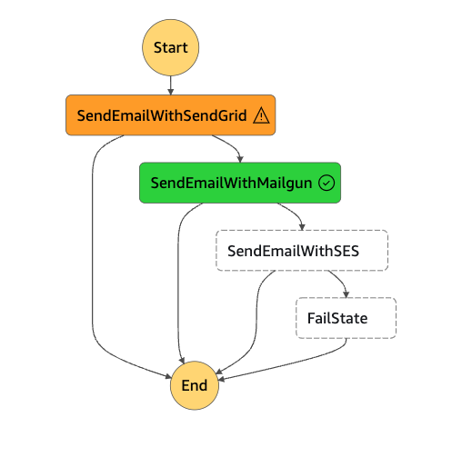

# Email Failover Service

This is a serverless email failover service that provides an abstraction between multiple email providers (SendGrid, Mailgun, SES). If one provider fails, the service will automatically switch to the next provider to ensure the email is sent. The failover process is managed using **AWS Step Functions** for resilience and reliability.

## Table of Contents

1. [Architecture Overview](#architecture-overview)
2. [Features](#features)
3. [Project Structure](#project-structure)
4. [Setup and Installation](#setup-and-installation)
5. [Usage](#usage)
6. [Testing](#testing)
7. [Frontend Integration](#frontend-integration)

## Architecture Overview

The service is built using **AWS Lambda** and **AWS Step Functions**. The key components include:

- **AWS Step Functions**: Handles the failover process, retrying with another provider if the first fails.
- **Email Providers**: Implementations for **SendGrid**, **Mailgun**, and **SES**, each in their own Lambda functions.
- **Serverless Framework**: Used to deploy the Lambda functions and configure the AWS infrastructure.
- **Step Functions Definition**: Orchestrates the email sending process between the different providers.
  Step Function Flow:

1. **SendEmailWithSendGrid**:

   - Starts by attempting to send the email using SendGrid.

2. **SendEmailWithMailgun**:

   - If SendGrid fails, the process retries with Mailgun.

3. **SendEmailWithSES**:

   - If both SendGrid and Mailgun fail, SES will be used as a final failover.

4. **FailState**:
   - If all providers fail, the process enters a fail state.

### Step Function Workflow

This is the flow of the Step Function used in the email service:



### Architecture Diagram

```
Client (React App)
   |
   |  POST /email/send
   v
API Gateway
   |
   v
AWS Lambda (send-email-lambda)
   |
   v
AWS Step Functions
   |
   v
Email Providers:
   - SendGrid
   - Mailgun
   - SES
   |
   v
CloudWatch (Logging/Monitoring)

```

## Features

- **Failover between multiple providers**: If one provider fails, the service automatically retries with another provider.
- **Scalable architecture**: Built using AWS Step Functions and AWS Lambda, allowing for auto-scaling.
- **Serverless deployment**: Easily deployable with **Serverless Framework**.
- **Environment isolation**: Uses `.env` for managing API keys and configuration values.
- **Pluggable providers**: Easily extendable to add more email providers.
- **CORS Support**: Configured to allow cross-origin requests from the frontend hosted on Netlify.

## Project Structure

```bash
/backendstepfunctions
  ├── node_modules
  ├── src
  │   ├── config               # Configuration files (Step Functions definition and request schema)
  │   │   ├── step-function-definition.json
  │   │   ├── email-request-schema.json
  │   ├── email-providers      # Provider services
  │   │   ├── mailgun-service.ts
  │   │   ├── send-grid-service.ts
  │   │   └── ses-service.ts
  │   │   └── email-service-factory.ts
  │   ├── handlers             # Lambda handlers
  │   │   ├── send-email-lambda.ts
  │   │   ├── send-email-handler.ts
  │   │   ├── send-email-with-mailgun.ts
  │   │   ├── send-email-with-sendgrid.ts
  │   │   └── send-email-with-ses.ts
  │   ├── email-types.ts
  ├── tests                    # Unit and integration tests
  ├── .env                     # Environment variables
  ├── package.json             # Project dependencies
  ├── serverless.yml           # Serverless Framework configuration
  └── README.md                # This file
```

## Setup and Installation

### Prerequisites

- **Node.js** (v18.x or higher recommended)
- **Serverless Framework** (`npm install -g serverless`)
- AWS account credentials (set in your local environment using `aws configure`)

### Step-by-step Installation

1. **Clone the repository**:

   ```bash
   git clone https://github.com/josmel/EmailServiceBackend.git
   cd EmailServiceBackend
   ```

2. **Install dependencies**:

   ```bash
   yarn install
   ```

3. **Create a `.env` file** with your email provider API keys:

   ```bash
   SENDGRID_API_KEY=your-sendgrid-api-key
   MAILGUN_API_KEY=your-mailgun-api-key
   MAILGUN_DOMAIN=your-mailgun-domain
   EMAIL_FROM=your-email@domain.com
   ```

4. **Deploy the service** to AWS:
   ```bash
   serverless deploy
   ```

## Usage

### Local Testing with Serverless Offline

To run the service locally with `serverless-offline`:

```bash
npm run offline
```

Once running, you can send POST requests to the local endpoint:

```bash
curl --location 'http://localhost:3000/dev/email/send' \
--header 'Content-Type: application/json' \
--data-raw '{
    "to": "recipient@example.com",
    "subject": "Test Email",
    "body": "This is a test email sent locally."
}'
```

### Production

To invoke the deployed service, use the AWS API Gateway URL:

```bash
curl -X POST https://{api-id}.execute-api.{region}.amazonaws.com/dev/email/send
--header "Content-Type: application/json"
--data-raw '{
   "to": "recipient@example.com",
   "subject": "Production Email",
   "body": "This is a production email."
}'
```

## Testing

Unit tests are located in the `tests` directory. You can run the tests using **Jest**:

```bash
npm run test
```

## Testing coverage

Unit tests are located in the `tests` directory. You can run the tests using **Jest**:

```bash
npm run test:coverage
```

### Example Test

```javascript
import { handler as sendEmailLambda } from '../src/handlers/send-email-lambda';

test('should trigger failover if the first provider fails', async () => {
  const event = {
    body: JSON.stringify({
      to: 'recipient@example.com',
      subject: 'Test Email',
      body: 'This is a test email.',
    }),
  };

  const result = await sendEmailLambda(event);
  expect(result.statusCode).toBe(200);
});
```

## lint and prettier

you can execute the following commands:

```bash
npm run lint
npm run lint:fix
npm run format
```

## Frontend Integration

The frontend of this service is hosted on Netlify and communicates with this backend using API Gateway endpoints. The CORS policy is configured to allow requests from the frontend domain.

### Frontend URL:

[https://emailserviceclient.netlify.app](https://emailserviceclient.netlify.app)
